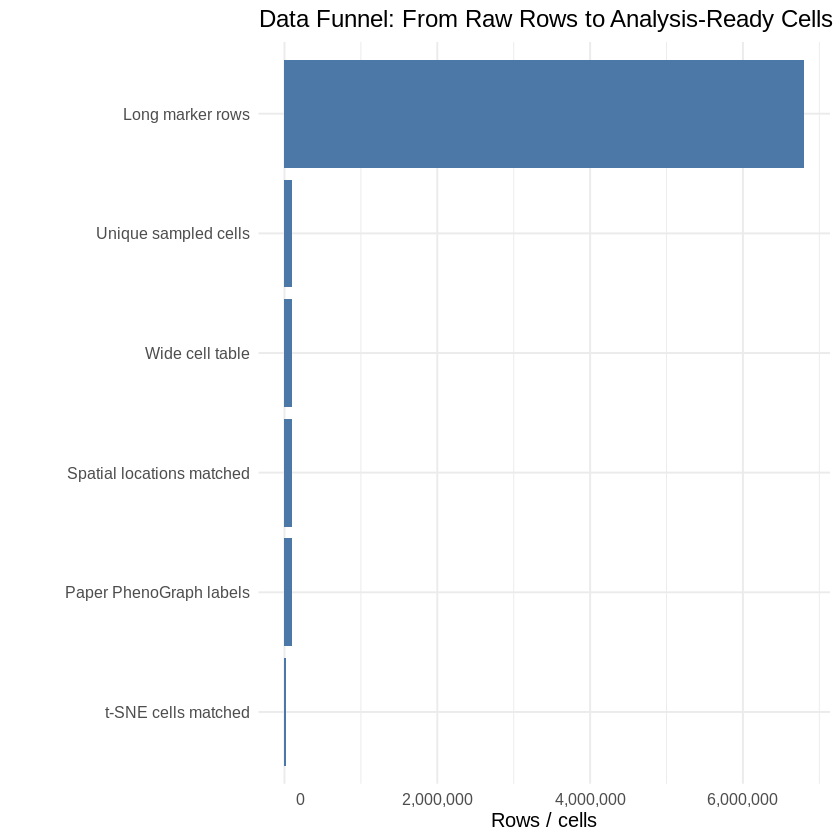
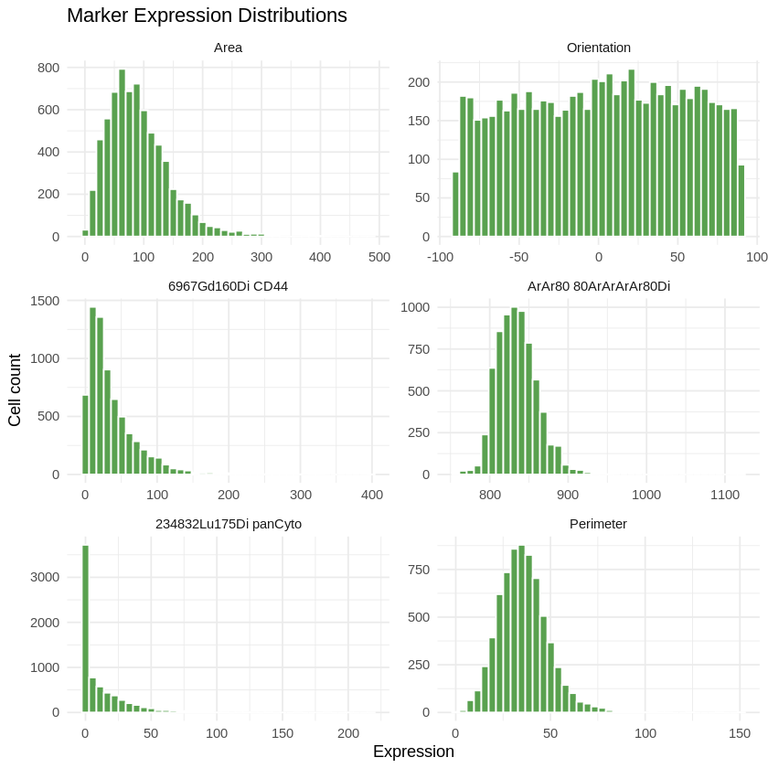
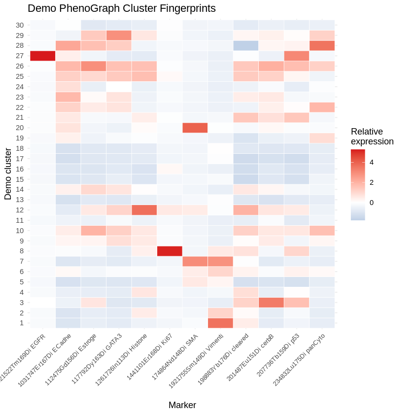
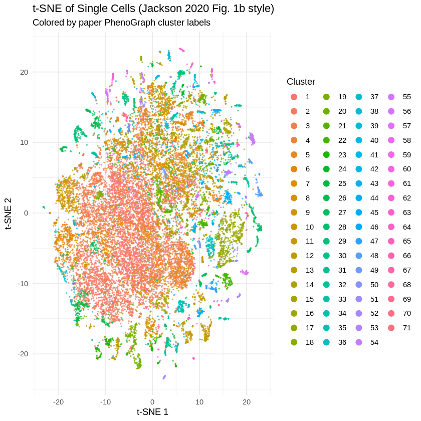
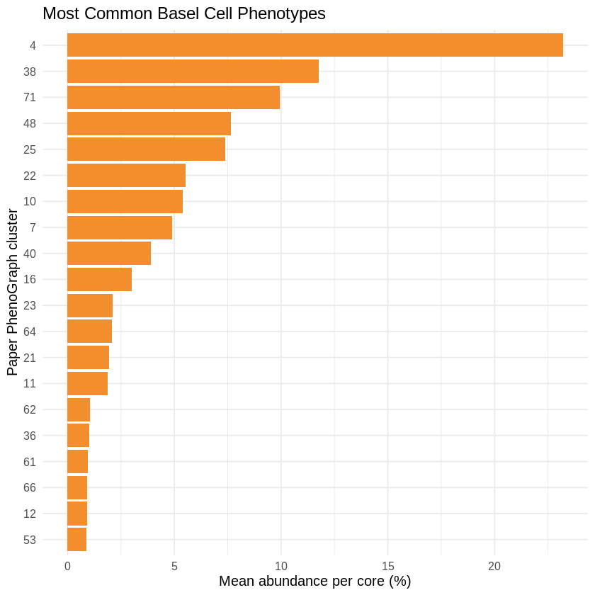
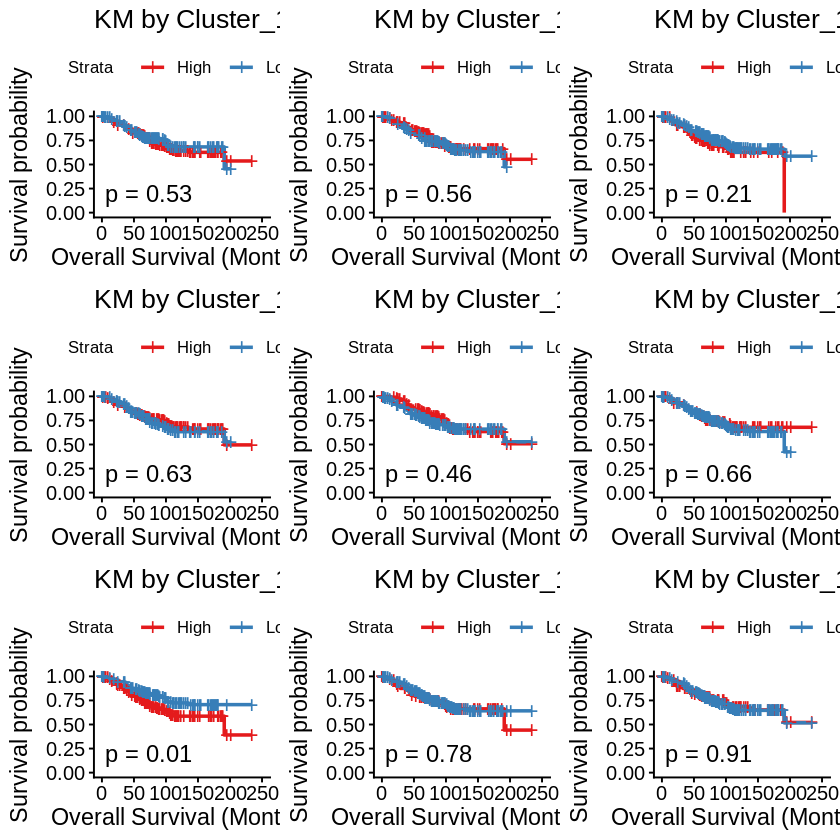
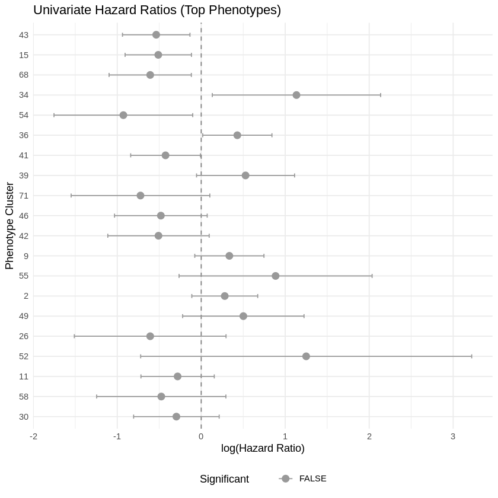
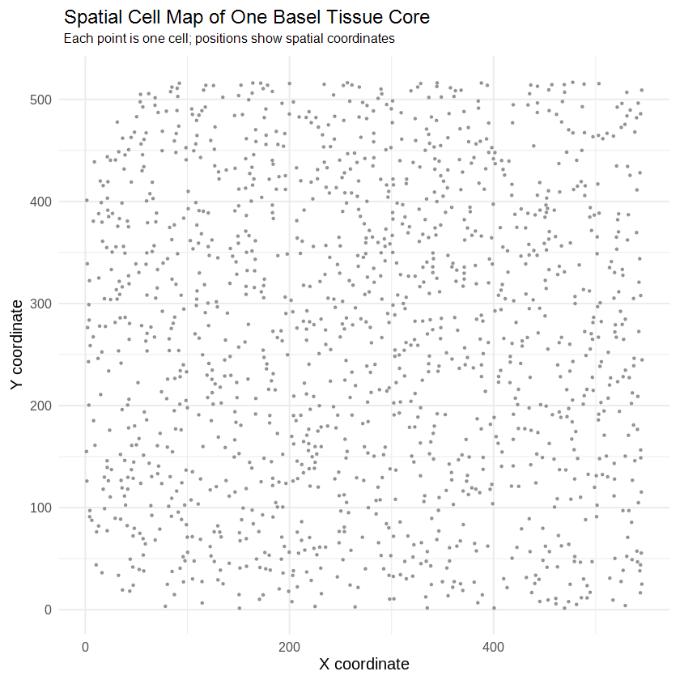
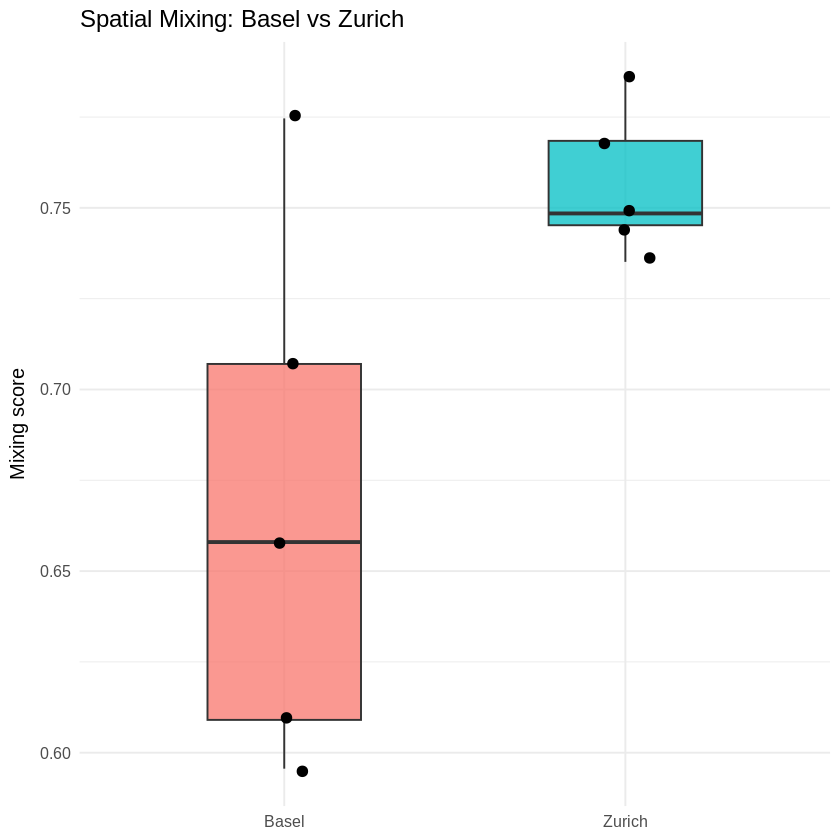
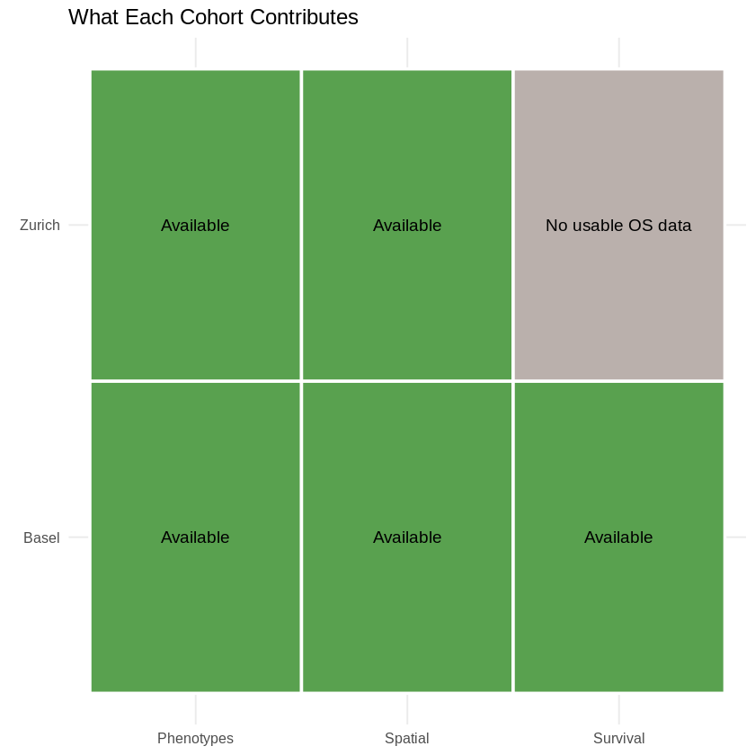

<div align="center">

# 🧬 Single-Cell Pathology Breast Cancer Replication

**A Colab-friendly reproduction of Jackson et al. 2020, focused on cell phenotypes, spatial tissue structure, and survival analysis.**

[](SurvivalAnalysis_github.ipynb)
[](https://www.r-project.org/)
[](https://doi.org/10.1038/s41586-019-1876-x)
[](https://doi.org/10.5281/zenodo.3518284)

[Overview](#overview) · [Results](#results) · [Figure Guide](#beginner-figure-guide) · [Key Outputs](#key-text-outputs) · [Run](#run-the-notebook) · [Glossary](#glossary)

</div>

---

## Overview

This project is a methodological replication of:

Hartland W. Jackson, Jana R. Fischer, Vito R. T. Zanotelli, et al. **"The single-cell pathology landscape of breast cancer."** Nature 578, 615-620 (2020). DOI: https://doi.org/10.1038/s41586-019-1876-x

The original study used **imaging mass cytometry** to measure many protein markers in breast cancer tissue at single-cell resolution. Instead of treating a tumor as one bulk sample, the paper looked at individual cells, grouped them into phenotypes, measured where those cells sit in tissue, and tested whether those patterns relate to patient survival.

This notebook does not rerun the full raw image-processing pipeline. That original pipeline is too large for a simple Google Colab demonstration. Instead, this project reproduces the core analysis logic using the public data and the paper's released phenotype labels where full recomputation would be too heavy.

## The Paper In Plain English

Imagine a tumor tissue slide as a city map.

- Each cell is one building.
- Each protein marker is a label on that building.
- Similar buildings form neighborhoods, or cell phenotypes.
- The X/Y coordinates tell us where each building sits in the city.
- The clinical question is whether some city layouts are linked to better or worse patient survival.

The paper's key idea is that cancer is not only about which cells exist. It is also about **how cells are arranged** and **which cell communities dominate a tumor**.

## What This Reproduces

The notebook follows this workflow:

```text
Single-cell marker data
        |
        v
Complete-cell sampling
        |
        v
Cell-by-marker matrix + spatial coordinates
        |
        v
Published PhenoGraph phenotype labels
        |
        v
Phenotype abundance per tissue core
        |
        v
Survival analysis, spatial mixing, and Basel-vs-Zurich comparison
```

The notebook also runs a small independent PhenoGraph clustering demonstration on sampled Basel cells. That demo is intentionally smaller than the full paper pipeline, but it shows how marker-expression profiles can become cell phenotype clusters.

## Repository Files

| File | Purpose |
| --- | --- |
| `SurvivalAnalysis_github.ipynb` | Cleaned notebook with outputs preserved. |
| `images/` | Extracted PNG figures from the notebook outputs. |
| `README.md` | Project explanation, figure guide, key outputs, and run guide. |

## Results

The final Colab run analyzed 100,000 complete sampled cells from Basel and 100,000 complete sampled cells from Zurich. Basel was the main survival cohort. Zurich was used for independent phenotype and spatial validation because usable merged survival rows were not available.

| Metric | Basel | Zurich |
| --- | ---: | ---: |
| Complete sampled cells | 100,000 | 100,000 |
| Wide cell table | 100,000 x 67 | 100,000 x 71 |
| Paper phenotype labels matched | 100,000 | 92,642 |
| Phenotypes available | 71 | 29 Basel-style matched phenotypes |
| Metadata/abundance records | 376 | 347 |
| Survival analysis | Yes | No usable merged survival rows |
| FDR-significant survival phenotypes | 0 / 71 | N/A |
| Spatial demo cores | 5 | 5 |
| Mean spatial mixing score | 0.669 | 0.757 |

The survival screen tested all 71 Basel phenotypes against overall survival. Some raw associations appeared for clusters such as 43, 15, 68, 34, and 54, but none survived FDR correction in this downsampled reproduction. The multivariable Cox model fitted successfully, although proportional-hazards diagnostics showed some violations, so those results should be interpreted cautiously.

## Beginner Figure Guide

The notebook is designed as a visual learning path. The images below were extracted directly from `SurvivalAnalysis_github.ipynb`.

### Figure 1: Data Funnel



What you are seeing:

This bar chart shows how the dataset moves from raw long-format marker rows into analysis-ready cells, spatial matches, paper cluster labels, and t-SNE matches.

How to read it:

- The biggest number is the raw marker-row table.
- A smaller number represents unique sampled cells.
- The later steps show how many cells could be matched to coordinates, phenotype labels, or t-SNE coordinates.

Why it matters:

The original single-cell file stores one cell across many marker rows. This plot helps beginners understand why we had to sample **complete cells**, not random rows.

### Figure 2: Marker Expression Distributions



What you are seeing:

Each small plot is a histogram for one protein marker. The x-axis is marker expression, and the y-axis is how many sampled cells have that expression level.

How to read it:

- A marker with a wide spread varies a lot across cells.
- A marker with a narrow spread is more similar across cells.
- Peaks suggest many cells share similar marker levels.

Why it matters:

Clustering only makes sense if cells differ from each other. These distributions show that cells have varied marker-expression patterns, which gives PhenoGraph signal to cluster.

### Figure 3: Demo Cluster Marker Heatmap



What you are seeing:

Rows are the independent demo PhenoGraph clusters. Columns are protein markers. Color shows whether a marker is relatively high or low in a cluster.

How to read it:

- Red means that marker is high in that cluster.
- Blue means that marker is low in that cluster.
- A row's color pattern is the cluster's marker fingerprint.

Why it matters:

Cluster numbers alone are not biologically meaningful. A heatmap turns cluster numbers into interpretable cell phenotypes by showing which markers define each cluster.

### Figure 4: t-SNE Cell Landscape



What you are seeing:

Each dot is one cell. The x/y axes are t-SNE coordinates, which place similar cells near each other. Color represents the paper's PhenoGraph phenotype label.

How to read it:

- Nearby cells have similar marker profiles.
- Separated islands often represent different cell states or broad phenotype groups.
- Color patches show where paper phenotypes appear in the landscape.

Why it matters:

This recreates the idea of the paper's cell atlas: many cells compressed into a 2D visual map so phenotype structure becomes visible.

### Figure 5: Phenotype Abundance Bar Plot



What you are seeing:

This chart ranks common Basel phenotypes by their average percentage across tissue cores.

How to read it:

- Longer bars are more common phenotypes.
- Shorter bars are rarer phenotypes.

Why it matters:

Survival analysis happens at the patient or tissue-core level, not the individual-cell level. This plot shows how single-cell labels become a patient-level feature: phenotype abundance.

### Figure 6: Kaplan-Meier Survival Curves



What you are seeing:

Each panel compares survival between patients with high vs low abundance of a selected phenotype.

How to read it:

- The x-axis is time in months.
- The y-axis is estimated survival probability.
- A curve that drops faster means more deaths happened earlier in that group.
- The p-value tests whether the high and low groups differ.

Why it matters:

This is the most intuitive survival output. It asks whether patients with more of a certain cell phenotype survived differently from patients with less of that phenotype.

### Figure 7: Hazard-Ratio Forest Plot



What you are seeing:

Each point is a phenotype's Cox-model hazard ratio on a log scale. The horizontal line is the confidence interval.

How to read it:

- Points to the right suggest higher risk.
- Points to the left suggest lower risk.
- Lines that cross the vertical zero line are not clearly different from no effect.
- Longer lines mean more uncertainty.

Why it matters:

The forest plot summarizes many survival tests in one place. In this run, none of the phenotype-survival associations were FDR-significant after multiple-testing correction.

### Figure 8: Spatial Cell Map



What you are seeing:

Each dot is a real cell location in one Basel tissue core. The colors show the most common paper PhenoGraph phenotypes in that core, while rarer phenotypes are grouped as `Other`.

How to read it:

- Dots close together are physically close cells in the tissue.
- Different colors show different cell phenotypes.
- Grey `Other` points are rarer phenotypes grouped together to keep the legend readable.
- Areas where colors mix show phenotype intermingling; areas dominated by one color suggest local enrichment of that phenotype.

Why it matters:

This is the easiest way to understand why this is **spatial** pathology. The data are not just a spreadsheet; they are maps of cells inside tissue, and each cell can be linked back to a phenotype label.

### Figure 9: Spatial Mixing, Basel vs Zurich



What you are seeing:

This plot compares spatial mixing scores for sampled Basel and Zurich tissue cores.

How to read it:

- Higher mixing means a cell's neighbors are often different phenotypes.
- Lower mixing means similar phenotypes are more clumped together.
- Zurich has a higher mean mixing score in this small spatial demo.

Why it matters:

The paper cares about tissue architecture. This plot demonstrates one simple way to quantify whether cell types are mixed or separated.

### Figure 10: Cohort Contribution Dashboard



What you are seeing:

This tile plot shows what each cohort contributed to the final analysis.

How to read it:

- Basel has phenotypes, spatial coordinates, and usable survival data.
- Zurich has phenotypes and spatial coordinates.
- Zurich does not have usable merged overall survival rows in this run.

Why it matters:

This is the final story of the notebook. Basel supports survival reproduction. Zurich supports independent phenotype and spatial validation.

## Key Text Outputs

Not every important result is an image. These notebook outputs are also central to the project.

### Package Setup

The notebook installs and loads the R packages needed for table processing, plotting, survival analysis, nearest-neighbor spatial analysis, and PhenoGraph clustering.

Important point:

`Rphenograph` is installed from GitHub because it was not available from CRAN for the Colab R version.

### Complete-Cell Sampling

Final sampled data:

| Cohort | Long-format rows | Unique cells |
| --- | ---: | ---: |
| Basel | 6,400,000 | 100,000 |
| Zurich | 6,800,000 | 100,000 |

Why this matters:

The first broken approach sampled random rows, which created incomplete cells. The corrected approach samples cell IDs first, then keeps all marker rows for those cells.

### Basel Master Table

Final Basel master table:

- 100,000 cells.
- 73 columns.
- 100,000 cells with spatial X/Y.
- 100,000 cells with paper PhenoGraph labels.
- 19,838 sampled cells matched to paper t-SNE coordinates.

Why this matters:

This table is the backbone of the Basel analysis.

### Independent PhenoGraph Demo

The notebook ran PhenoGraph on:

- 10,000 sampled Basel cells.
- 33 marker columns.
- k = 20 nearest neighbors.

Output:

- 30 demo clusters.
- Adjusted Rand Index vs paper labels: 0.131.

Interpretation:

The low ARI is expected. The demo uses a small sample and simplified preprocessing, while the paper used a full-scale pipeline. The purpose is to demonstrate the method, not perfectly reproduce the paper's cluster labels from scratch.

### Basel Survival Screen

The notebook tested:

- 376 Basel records.
- 102 death events.
- 71 phenotypes.

Top raw associations:

- Cluster 43.
- Cluster 15.
- Cluster 68.
- Cluster 34.
- Cluster 54.

Final corrected result:

- FDR-significant phenotypes: 0 / 71.

Interpretation:

Some raw p-values were interesting, but after correcting for many tests, none remained significant in this downsampled reproduction.

### Multivariable Cox Model

The multivariable Cox model fitted successfully using selected phenotype features and clinical subtype.

Important diagnostic:

The proportional-hazards test showed assumption violations for some covariates.

Interpretation:

The model is useful as a demonstration, but diagnostics must be reported. This is a good example of scientific honesty: a model running successfully is not the same as a model being assumption-free.

### Zurich Loading And Matching

Zurich results:

- 100,000 sampled cells.
- 92,642 cells with PhenoGraph labels.
- 41 Zurich clusters.
- 33 common markers used for matching.
- 29 Basel-style phenotypes represented after matching.
- 347 metadata/abundance records.

Interpretation:

Zurich is useful for phenotype and spatial validation. Its cluster IDs are mapped to Basel-style labels using marker-profile similarity.

### Zurich Survival Skip

Output:

- Usable Zurich survival rows: 0.

Interpretation:

Zurich survival analysis was skipped because no usable non-missing overall-survival rows remained after merging metadata with phenotype abundance. This is not a crash; it is the correct scientific decision.

### Cross-Cohort Summary

| Metric | Result |
| --- | --- |
| Basel survival records | 376 |
| Zurich metadata/abundance records | 347 |
| Basel phenotypes tested | 71 |
| Zurich matched Basel-style phenotypes | 29 |
| Basel FDR-significant phenotypes | 0 / 71 |
| Zurich survival available | False |
| Basel mean spatial mixing | 0.669 |
| Zurich mean spatial mixing | 0.757 |

Final interpretation:

Basel is the main survival reproduction. Zurich is an independent phenotype/spatial validation cohort.

## Run The Notebook

Use `SurvivalAnalysis_github.ipynb` as the main deliverable. Open it in Google Colab, use an R runtime if available, and run the notebook from top to bottom. If Colab opens as Python, create an R notebook from https://colab.research.google.com/notebook#create=true&language=r, then load the notebook content there.

## Common Issues

### Rphenograph does not install

`Rphenograph` may not install from CRAN in Colab. The notebook installs it from GitHub using `JinmiaoChenLab/Rphenograph`.

### The subset has only about one row per cell

That means cells were sampled incorrectly by row. The original `SC_dat.csv` is long-format, so cells must be sampled by complete cell ID.

### Cox model warnings appear

Cox model warnings can happen with rare clusters or small event counts. Report the warnings, use FDR-adjusted results, and treat diagnostics as part of the result rather than an error to hide.

## Limitations

This is a methodological replication, not a pixel-perfect reproduction.

Not fully reproduced:

- Raw imaging mass cytometry acquisition.
- Raw image segmentation.
- Full original MATLAB/histoCAT workflow.
- Full-scale clustering of all cells from scratch.
- Exact paper figures and exact paper statistics.

That tradeoff is intentional. The notebook focuses on showing the scientific workflow in a form that can run in Colab.

## Glossary

### Imaging Mass Cytometry

A microscopy method that measures many protein markers in the same tissue while preserving cell locations.

### Marker

A protein measurement used to describe a cell.

### Cell Phenotype

A group of cells with similar marker-expression patterns.

### PhenoGraph

A clustering algorithm used in single-cell biology. It groups cells by similarity.

### t-SNE

A visualization method that turns high-dimensional cell measurements into a 2D map.

### Phenotype Abundance

The percentage of cells in a tissue core belonging to a given phenotype.

### Kaplan-Meier Curve

A survival plot showing estimated survival probability over time.

### Cox Proportional Hazards Model

A survival model used to estimate whether a variable is associated with higher or lower risk over time.

### Hazard Ratio

A risk estimate from a Cox model.

| Hazard ratio | Meaning |
| --- | --- |
| Greater than 1 | Higher risk |
| Equal to 1 | No clear risk difference |
| Less than 1 | Lower risk |

### FDR Adjustment

A correction for testing many hypotheses. It reduces false discoveries when many phenotypes are tested.

### Spatial Mixing Score

A score measuring how often a cell's nearest neighbors are different phenotypes. Higher values mean more mixing.

## Sources

| Source | Link |
| --- | --- |
| Jackson et al. Nature paper | https://doi.org/10.1038/s41586-019-1876-x |
| Nature article page | https://www.nature.com/articles/s41586-019-1876-x |
| Original code repository | https://github.com/BodenmillerGroup/SCPathology_publication |
| Zenodo main data record | https://doi.org/10.5281/zenodo.3518284 |
| Zenodo locations record | https://doi.org/10.5281/zenodo.4607374 |
